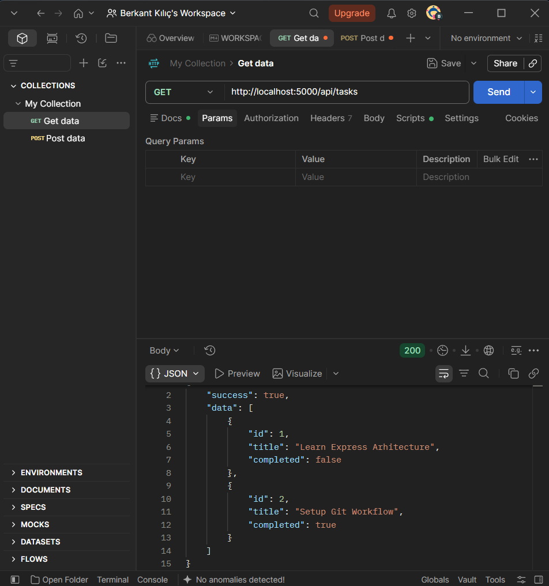
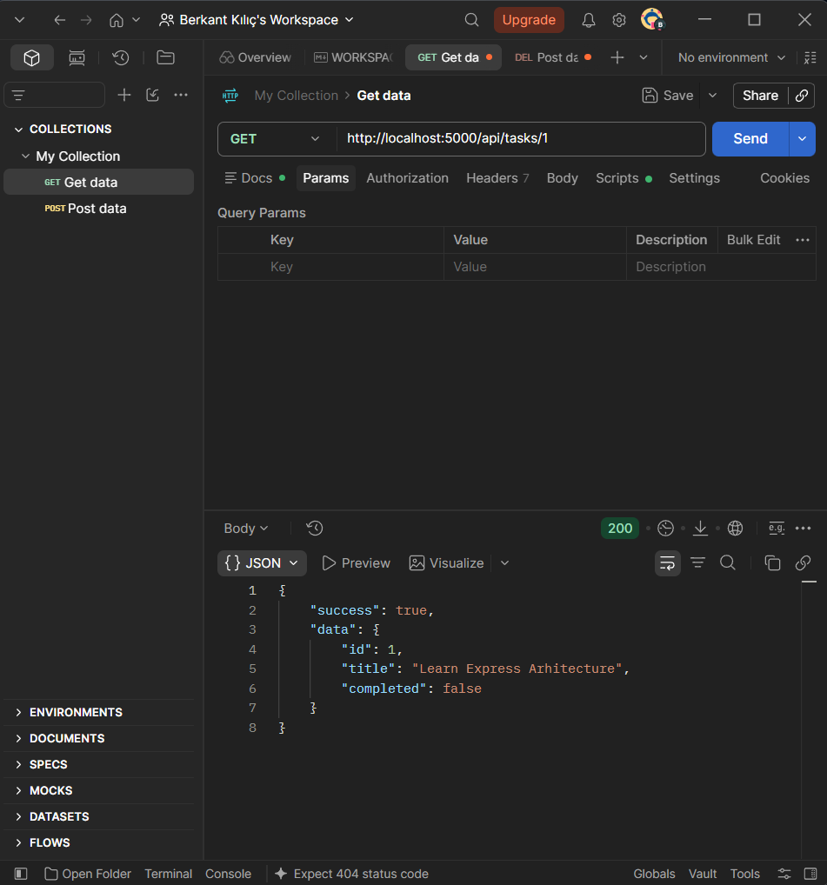
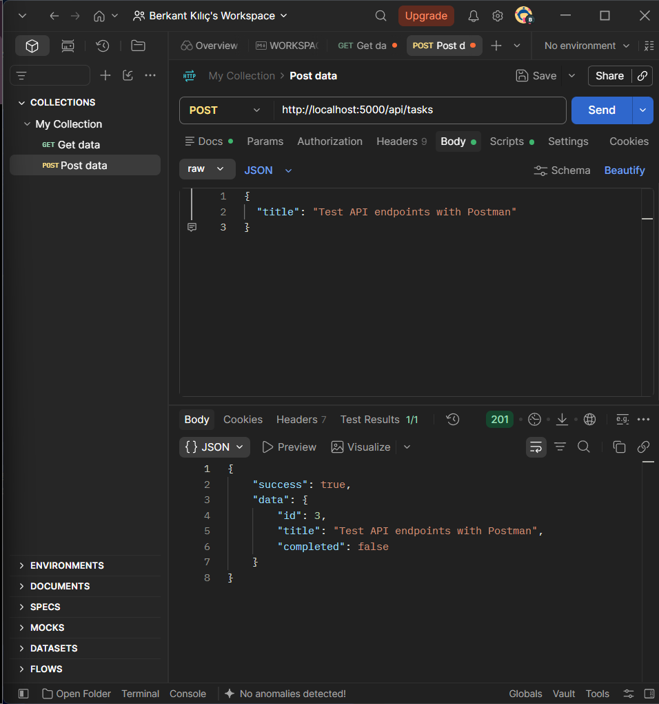
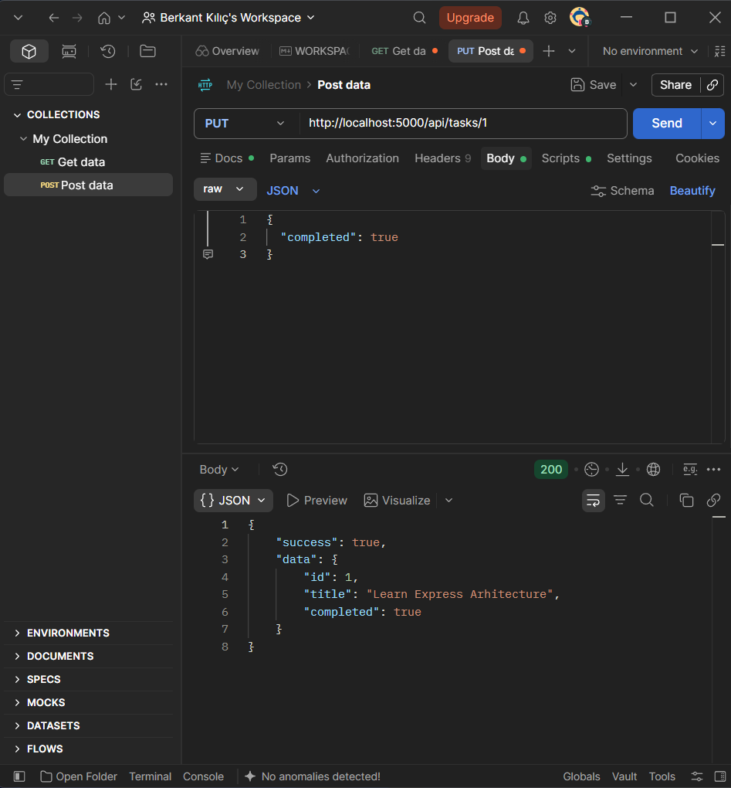
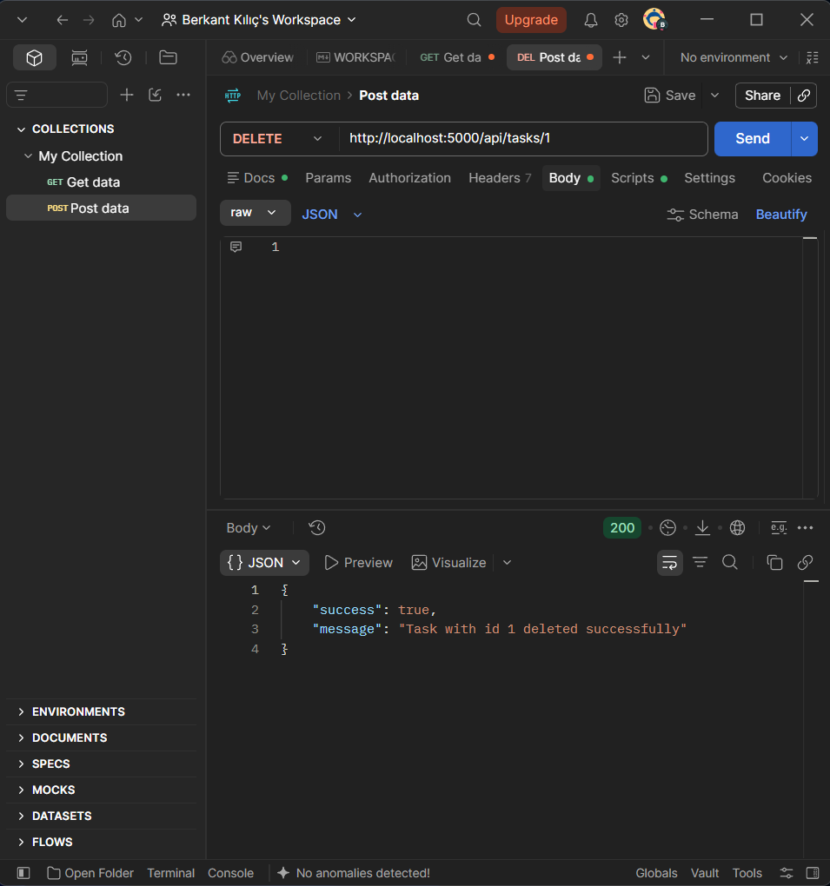
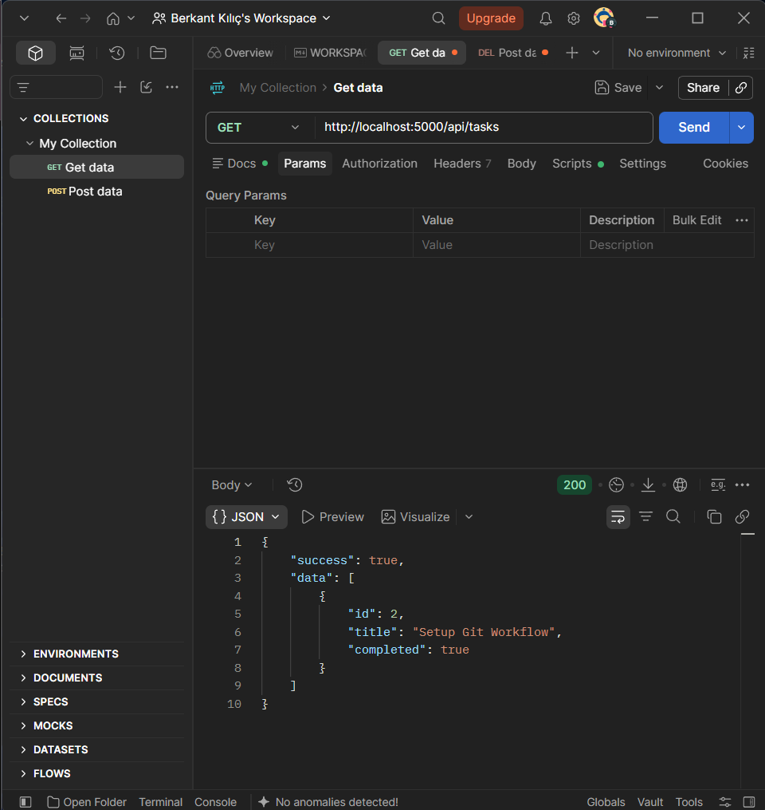
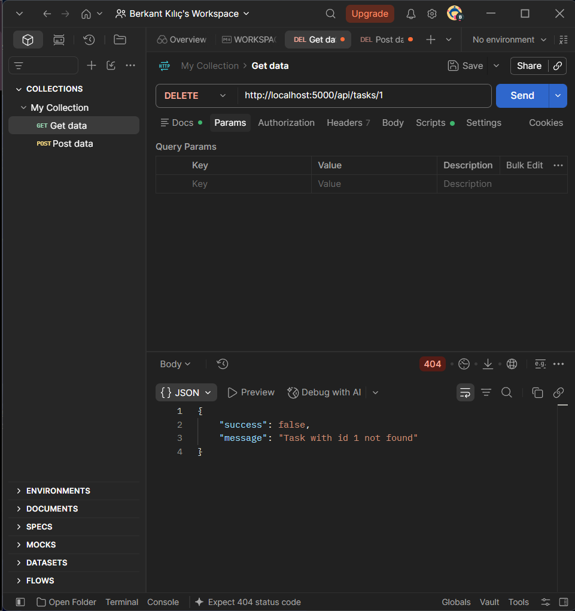

<div align="center">

# TASKFLOW - Task Management System REST API

[](https://nodejs.org/)
[](https://expressjs.com/)
[](https://www.postman.com/)

<br/>

**[English](#english) | [Türkçe](#turkce)**

</div>

---

<h2 id="english">English</h2>

### Project Overview
**TaskFlow** is a modular RESTful API built with Node.js and Express.js for managing team workflows, development tasks, and assignments. It features an in-memory data store, clean separation of concerns across layers, custom logging middleware, and comprehensive CRUD endpoints.

### Key Features
- **RESTful Architecture:** Follows semantic HTTP status codes (`200 OK`, `201 Created`, `400 Bad Request`, `404 Not Found`).
- **Full CRUD Support:** Complete task lifecycle management (Create, Read All, Read by ID, Partial Update, and Delete).
- **Custom Logging Middleware:** Logs every incoming request's timestamp (ISO format), HTTP method, and route URL to the console.
- **Data Validation & Error Handling:** Validates payload parameters and handles missing resource exceptions cleanly.
- **Modular Directory Structure:** Isolated layers for controllers, routes, and middlewares.

### Tech Stack
- **Runtime:** Node.js
- **Framework:** Express.js
- **API Client:** Postman
- **Dev Utility:** Nodemon

### Project Architecture
```text
taskflow-backend/
├── screenshots/
│   ├── 01-get-all-tasks.png
│   ├── 02-get-task-by-id.png
│   ├── 03-create-task.png
│   ├── 04-update-task.png
│   ├── 05-delete-task.png
│   ├── 06-verify-delete.png
│   └── 07-error-404.png
├── src/
│   ├── controllers/
│   │   └── taskController.js
│   ├── middlewares/
│   │   └── logger.js
│   ├── routes/
│   │   └── taskRoutes.js
│   └── server.js
├── .gitignore
├── package.json
└── README.md
```

### API Endpoints
| Method | Endpoint | Description | Status Code |
| :--- | :--- | :--- | :--- |
| `GET` | `/api/tasks` | Fetch all tasks | `200 OK` |
| `GET` | `/api/tasks/:id` | Fetch task by specific ID | `200 OK` / `404 Not Found` |
| `POST` | `/api/tasks` | Create a new task | `201 Created` / `400 Bad Request` |
| `PUT` | `/api/tasks/:id` | Update task details | `200 OK` / `404 Not Found` |
| `DELETE` | `/api/tasks/:id` | Delete task by ID | `200 OK` / `404 Not Found` |

### Getting Started
1. Clone the repository:
   ```bash
   git clone [https://github.com/berkantkilic777-gif/taskflow-backend.git](https://github.com/berkantkilic777-gif/taskflow-backend.git)
   cd taskflow-backend
   ```
2. Install dependencies:
   ```bash
   npm install
   ```
3. Run the development server:
   ```bash
   npm run dev
   ```
   The server will start on `http://localhost:5000`.

### Postman Verification
Verified test results confirming endpoint functionality:

#### 1. Retrieve All Tasks (GET)


#### 2. Retrieve Task by ID (GET)


#### 3. Create Task (POST)


#### 4. Update Task (PUT)


#### 5. Delete Task (DELETE)


#### 6. Verify Deletion


#### 7. Error Handling - 404 Not Found


---

<h2 id="turkce">Türkçe</h2>

### Proje Tanıtımı
**TaskFlow**, yazılım ekiplerinin proje süreçlerini, iş listelerini ve görev sorumluluklarını takip etmek amacıyla Node.js ve Express.js kullanılarak geliştirilmiş bir RESTful API'dir. Bellek içi veri yönetimi, katmanlı mimari, özel logger middleware ve eksiksiz CRUD işlevselliği sunar.

### Temel Özellikler
- **RESTful Standartlar:** Anlamsal HTTP durum kodları (`200 OK`, `201 Created`, `400 Bad Request`, `404 Not Found`) ile tam uyum.
- **Eksiksiz CRUD Döngüsü:** Görev oluşturma, tümünü listeleme, tekil ID ile sorgulama, güncelleme ve silme operasyonları.
- **Özel Logger Middleware:** Gelen her HTTP isteğini zaman damgası (ISO formatı), istek metodu ve rota bilgisiyle konsola yazar.
- **Hata ve İstisna Yönetimi:** Zorunlu alan (`title`) kontrolleri ve bulunamayan kaynaklar için açıklayıcı JSON yanıtları.
- **Modüler Klasör Mimarisi:** Route, Controller ve Middleware katmanlarının birbirinden izole ayrımı.

### Kullanılan Teknolojiler
- **Çalışma Ortamı:** Node.js
- **Web Çatısı:** Express.js
- **API Test:** Postman
- **Geliştirici Aracı:** Nodemon

### Proje Klasör Hiyerarşisi
```text
taskflow-backend/
├── screenshots/
│   ├── 01-get-all-tasks.png
│   ├── 02-get-task-by-id.png
│   ├── 03-create-task.png
│   ├── 04-update-task.png
│   ├── 05-delete-task.png
│   ├── 06-verify-delete.png
│   └── 07-error-404.png
├── src/
│   ├── controllers/
│   │   └── taskController.js
│   ├── middlewares/
│   │   └── logger.js
│   ├── routes/
│   │   └── taskRoutes.js
│   └── server.js
├── .gitignore
├── package.json
└── README.md
```

### API Uç Noktaları (Endpoints)
| Metot | Uç Nokta | Açıklama | Başarı Durum Kodu |
| :--- | :--- | :--- | :--- |
| `GET` | `/api/tasks` | Tüm görevleri listeler | `200 OK` |
| `GET` | `/api/tasks/:id` | ID'ye göre tekil görevi getirir | `200 OK` / `404 Not Found` |
| `POST` | `/api/tasks` | Yeni bir görev oluşturur | `201 Created` / `400 Bad Request` |
| `PUT` | `/api/tasks/:id` | Görev bilgilerini günceller | `200 OK` / `404 Not Found` |
| `DELETE` | `/api/tasks/:id` | Görevi sistemden siler | `200 OK` / `404 Not Found` |

### Kurulum ve Çalıştırma
1. Projeyi yerel makinenize klonlayın:
   ```bash
   git clone [https://github.com/berkantkilic777-gif/taskflow-backend.git](https://github.com/berkantkilic777-gif/taskflow-backend.git)
   cd taskflow-backend
   ```
2. Gerekli bağımlılıkları yükleyin:
   ```bash
   npm install
   ```
3. Geliştirici sunucusunu başlatın:
   ```bash
   npm run dev
   ```
   Sunucu varsayılan olarak `http://localhost:5000` portunda çalışacaktır.

### Postman Test Kanıtları
Geliştirilen uç noktaların başarılı çalıştığını gösteren Postman test çıktıları:

#### 1. Tüm Görevleri Listeleme (GET)


#### 2. Tekil Görev Detayı (GET)


#### 3. Yeni Görev Ekleme (POST)


#### 4. Görev Güncelleme (PUT)


#### 5. Görev Silme (DELETE)


#### 6. Silme İşlemi Doğrulaması


#### 7. Hata Yönetimi - 404 Not Found
