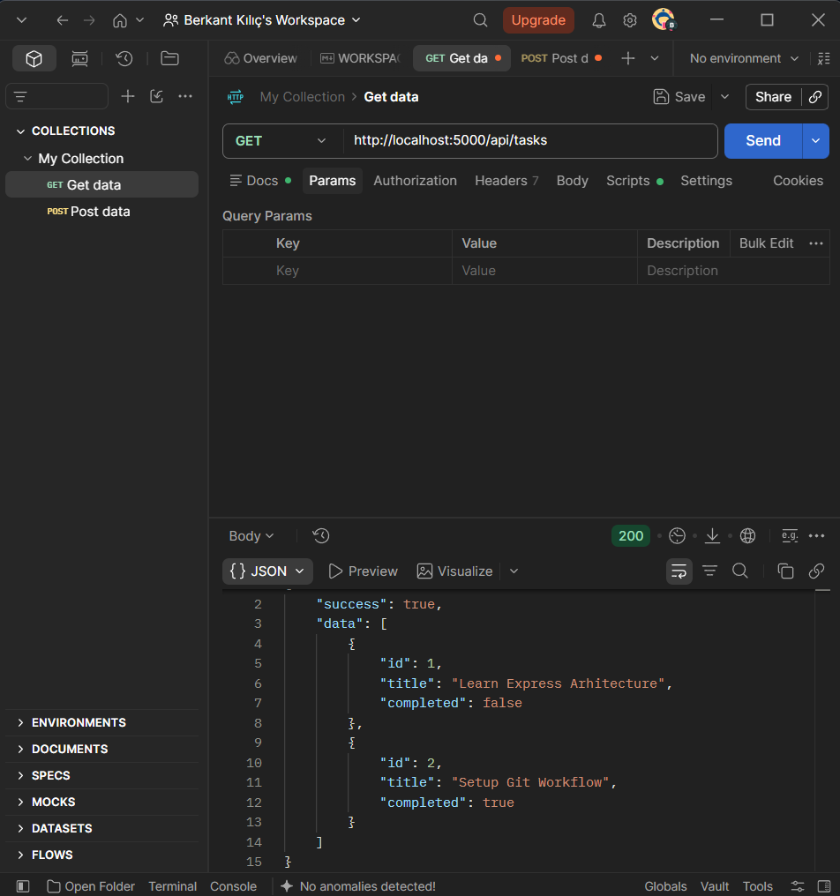
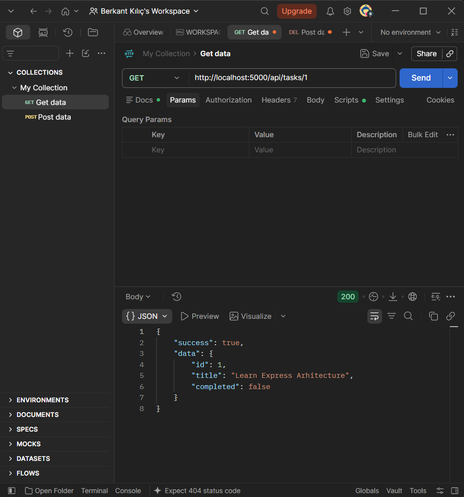
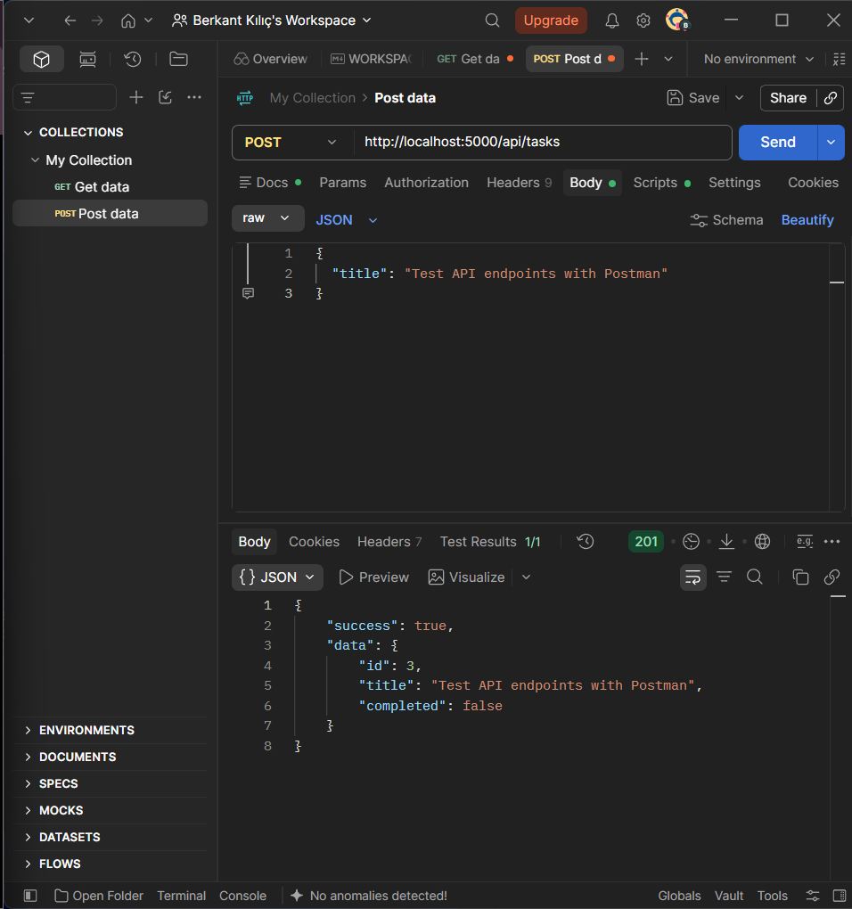
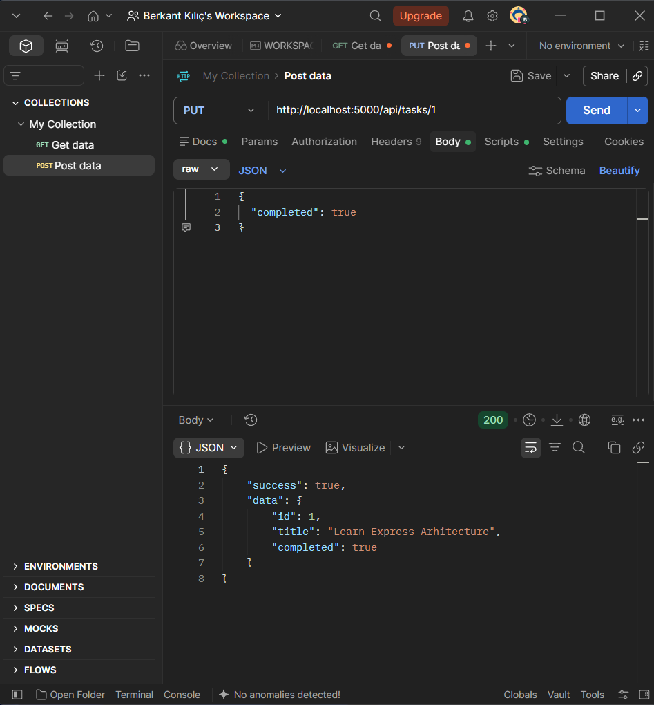
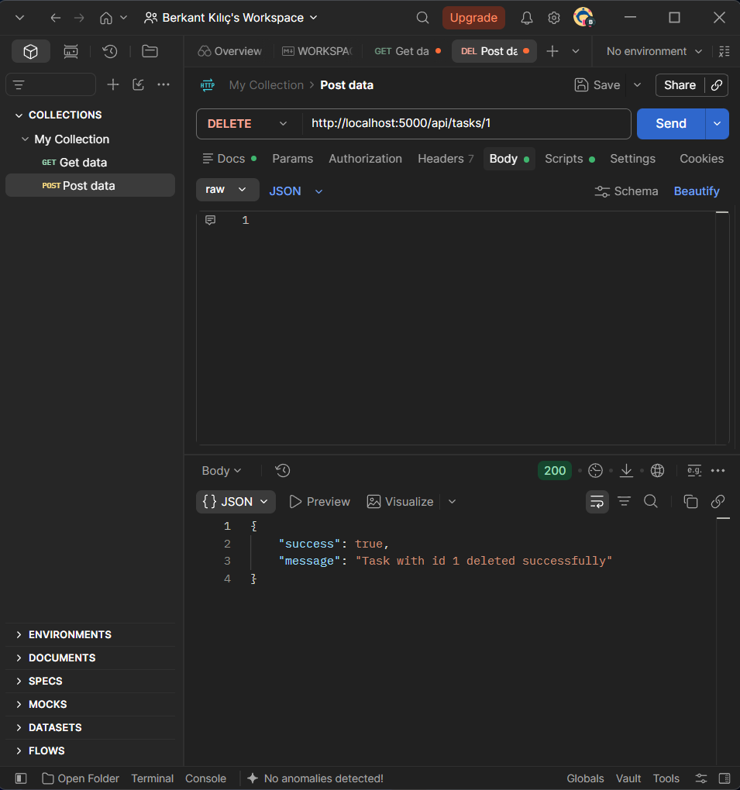
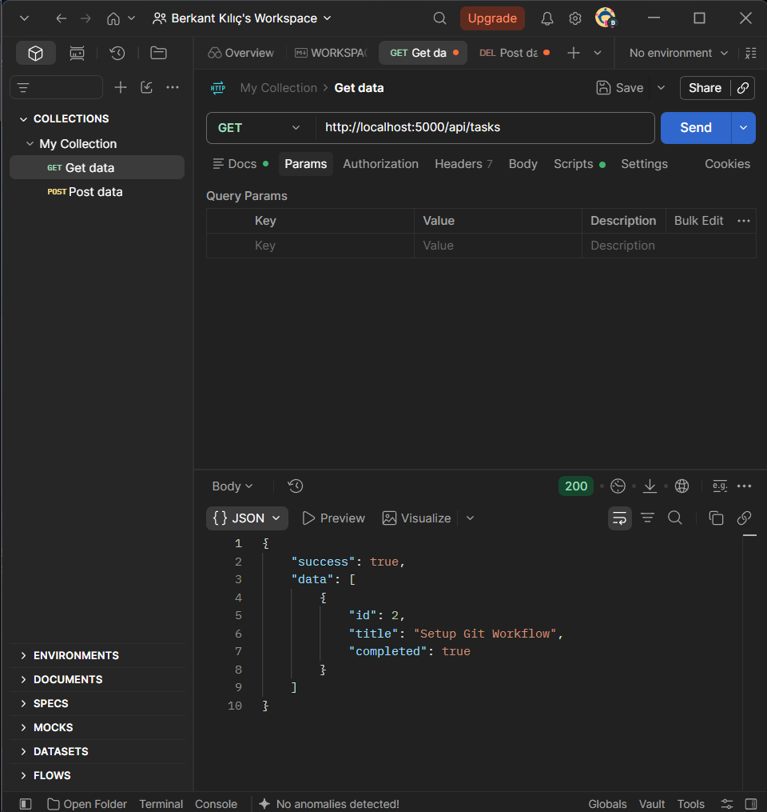
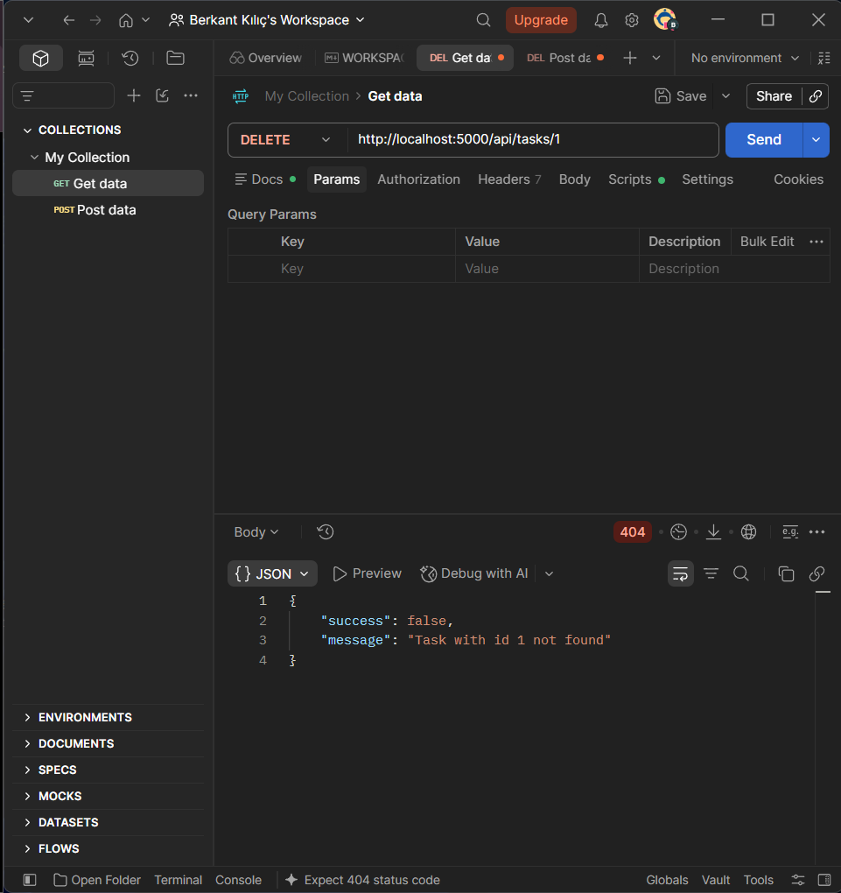

<div align="center">

# TASKFLOW - Task Management System REST API

[](https://nodejs.org/)
[](https://expressjs.com/)
[](https://www.postman.com/)
[](https://expressjs.com/)

<br/>

**[English](#english) | [Türkçe](#turkce)**

</div>

---

<h2 id="english">English</h2>

### Project Overview
TaskFlow is a modular, production-ready RESTful API developed with Node.js and Express.js designed for team workflow tracking, project assignment, and workload reporting. Built around a layered architectural design, the system features complete CRUD operations, custom request logging, input validation middleware, advanced search and pagination mechanics, and dynamic reporting services.

### Core and Advanced Features
- Core CRUD Operations: Comprehensive task lifecycle management (Create, Read All, Read by ID, Partial/Full Update, and Delete).
- Custom Logging Middleware: Tracks and logs every incoming HTTP request's ISO timestamp, method, and URL.
- Validation Middleware (Advanced): Intercepts POST requests to strictly validate task payloads (title requirement, allowed priority values) returning semantic 400 Bad Request responses.
- Advanced Search and Filtering: Real-time keyword search across task titles and descriptions, status filtering, priority filtering, and assignee filtering.
- Pagination and Sorting: Supports query pagination (`page`, `limit`) with metadata and timestamp sorting.
- Analytical Reporting Services: Dedicated reporting endpoints delivering aggregated task statistics, pending counts, completion metrics, and priority distributions.
- Architecture and Code Quality: Clean separation of concerns across controllers, routes, and middlewares with standard HTTP status conventions.

### Tech Stack
- Runtime: Node.js
- Framework: Express.js (v5.x)
- API Client and Testing: Postman
- Dev Tool: Nodemon

### Project Architecture
```text
taskflow-backend/
├── screenshots/
│   ├── 01-get-all-tasks.png
│   ├── 02-get-task-by-id.png
│   ├── 03-create-task.png
│   ├── 04-update-task.png
│   ├── 05-delete-task.png
│   ├── 06-verify-delete.png
│   └── 07-error-404.png
├── src/
│   ├── controllers/
│   │   ├── reportController.js
│   │   └── taskController.js
│   ├── middlewares/
│   │   ├── logger.js
│   │   └── validateTask.js
│   ├── routes/
│   │   ├── reportRoutes.js
│   │   └── taskRoutes.js
│   └── server.js
├── .gitignore
├── package.json
└── README.md
```

### API Endpoints

#### 1. Task Operations
| Method | Endpoint | Description | Status Code |
| :--- | :--- | :--- | :--- |
| GET | `/api/tasks` | Fetch all tasks (supports filtering, sorting & pagination) | 200 OK |
| GET | `/api/tasks/:id` | Fetch task by specific ID | 200 OK / 404 Not Found |
| GET | `/api/tasks/search?keyword=...` | Search tasks by keyword in title or description | 200 OK / 400 Bad Request |
| GET | `/api/tasks/assignee/:name` | Fetch tasks assigned to a specific user | 200 OK |
| POST | `/api/tasks` | Create a new task (validated by middleware) | 201 Created / 400 Bad Request |
| PUT | `/api/tasks/:id` | Update task by ID | 200 OK / 404 Not Found |
| DELETE | `/api/tasks/:id` | Delete task by ID | 200 OK / 404 Not Found |

#### 2. Query Parameters (GET /api/tasks)
- `status`: Filter by completion (`completed` or `pending`)
- `priority`: Filter by priority level (`low`, `medium`, `high`)
- `assignee`: Filter by username (e.g. `musa`, `berkant`)
- `sort`: Sort tasks (`createdAt` or `-createdAt`)
- `page` & `limit`: Paginate results (e.g. `?page=1&limit=2`)

#### 3. Reporting Services
| Method | Endpoint | Description | Status Code |
| :--- | :--- | :--- | :--- |
| GET | `/api/reports/completed` | List completed tasks and count | 200 OK |
| GET | `/api/reports/pending` | List pending tasks and count | 200 OK |
| GET | `/api/reports/summary` | High-level summary, completion rates, and priority distribution | 200 OK |

### Installation and Setup
1. Clone the repository:
   ```bash
   git clone [https://github.com/berkantkilic777-gif/taskflow-backend.git](https://github.com/berkantkilic777-gif/taskflow-backend.git)
   cd taskflow-backend
   ```
2. Install dependencies:
   ```bash
   npm install
   ```
3. Run the development server:
   ```bash
   npm run dev
   ```
   Server runs on `http://localhost:5000`.

### Postman Verification
Verified test results confirming baseline CRUD endpoint functionality:

#### 1. Retrieve All Tasks (GET)


#### 2. Retrieve Task by ID (GET)


#### 3. Create Task (POST)


#### 4. Update Task (PUT)


#### 5. Delete Task (DELETE)


#### 6. Verify Deletion


#### 7. Error Handling - 404 Not Found


---

<h2 id="turkce">Türkçe</h2>

### Proje Tanıtımı
TaskFlow; yazılım ekiplerinin iş listelerini, görev atamalarını ve iş yükü durumlarını takip etmek amacıyla Node.js ve Express.js kullanılarak geliştirilmiş, üretime hazır ve modüler bir RESTful API'dir. Katmanlı mimari prensiplerine uygun olarak tasarlanan sistem; eksiksiz CRUD işlevselliği, özel istek loglama middleware'i, girdi doğrulama (validation) katmanı, gelişmiş arama/sayfalama özellikleri ve sistem geneli raporlama servisleri sunar.

### Temel ve İleri Seviye Özellikler
- Eksiksiz CRUD Döngüsü: Görev oluşturma, listeleme, tekil ID ile sorgulama, güncelleme ve silme operasyonları.
- Özel Logger Middleware: Gelen her HTTP isteğini zaman damgası (ISO formatı), HTTP metodu ve rota bilgisiyle konsola yazar.
- Doğrulama Middleware (Validation): Yeni görev ekleme isteklerinde zorunlu alan kontrolü (`title`) ve geçerli öncelik seviyesi (`priority`) denetimi yaparak geçersiz isteklerde anlamlı 400 Bad Request yanıtı döner.
- Gelişmiş Arama ve Filtreleme: Görev başlığı ve açıklamasında anlık kelime arama (`/search`), duruma göre filtreleme (`status`), önceliğe göre filtreleme (`priority`) ve kullanıcı bazlı sorgulama (`assignee`).
- Sayfalama ve Sıralama: Büyük veri setleri için sayfalama mekanizması (`page`, `limit`), sayfa metadataları ve tarih bazlı sıralama (`sort`).
- Raporlama Servisleri: Tamamlanan, bekleyen ve tüm sistemin tamamlama yüzdesi ile öncelik dağılımını hesaplayan analitik rapor uç noktaları.
- Temiz Mimari ve Standartlar: Controller, Route ve Middleware katmanlarının birbirinden izole ayrımı ve anlamsal HTTP durum kodları (`200`, `201`, `400`, `404`).

### Kullanılan Teknolojiler
- Çalışma Ortamı: Node.js
- Web Çatısı: Express.js (v5.x)
- API Test Aracı: Postman
- Geliştirici Aracı: Nodemon

### Proje Klasör Hiyerarşisi
```text
taskflow-backend/
├── screenshots/
│   ├── 01-get-all-tasks.png
│   ├── 02-get-task-by-id.png
│   ├── 03-create-task.png
│   ├── 04-update-task.png
│   ├── 05-delete-task.png
│   ├── 06-verify-delete.png
│   └── 07-error-404.png
├── src/
│   ├── controllers/
│   │   ├── reportController.js
│   │   └── taskController.js
│   ├── middlewares/
│   │   ├── logger.js
│   │   └── validateTask.js
│   ├── routes/
│   │   ├── reportRoutes.js
│   │   └── taskRoutes.js
│   └── server.js
├── .gitignore
├── package.json
└── README.md
```

### API Uç Noktaları (Endpoints)

#### 1. Görev İşlemleri
| Metot | Uç Nokta | Açıklama | Durum Kodu |
| :--- | :--- | :--- | :--- |
| GET | `/api/tasks` | Tüm görevleri listeler (filtreleme, sıralama ve sayfalama destekler) | 200 OK |
| GET | `/api/tasks/:id` | ID'ye göre tekil görevi getirir | 200 OK / 404 Not Found |
| GET | `/api/tasks/search?keyword=...` | Başlık veya açıklamada anahtar kelime ile arama yapar | 200 OK / 400 Bad Request |
| GET | `/api/tasks/assignee/:name` | Belirli bir kullanıcıya atanan görevleri listeler | 200 OK |
| POST | `/api/tasks` | Yeni görev oluşturur (validation middleware denetimli) | 201 Created / 400 Bad Request |
| PUT | `/api/tasks/:id` | Görev bilgilerini günceller | 200 OK / 404 Not Found |
| DELETE | `/api/tasks/:id` | Görevi sistemden siler | 200 OK / 404 Not Found |

#### 2. Sorgu Parametreleri (GET /api/tasks)
- `status`: Görev durumuna göre filtreler (`completed` veya `pending`)
- `priority`: Öncelik seviyesine göre filtreler (`low`, `medium`, `high`)
- `assignee`: Görevliye göre filtreler (örn: `musa`, `berkant`)
- `sort`: Tarihe göre sıralar (`createdAt` veya `-createdAt`)
- `page` & `limit`: Sayfalama yapar (örn: `?page=1&limit=2`)

#### 3. Raporlama Servisleri
| Metot | Uç Nokta | Açıklama | Durum Kodu |
| :--- | :--- | :--- | :--- |
| GET | `/api/reports/completed` | Tamamlanan görev sayısını ve listesini döner | 200 OK |
| GET | `/api/reports/pending` | Bekleyen görev sayısını ve listesini döner | 200 OK |
| GET | `/api/reports/summary` | Toplam görev, tamamlanma yüzdesi ve öncelik dağılımını özetler | 200 OK |

### Kurulum ve Çalıştırma
1. Projeyi yerel makinenize klonlayın:
   ```bash
   git clone [https://github.com/berkantkilic777-gif/taskflow-backend.git](https://github.com/berkantkilic777-gif/taskflow-backend.git)
   cd taskflow-backend
   ```
2. Gerekli bağımlılıkları yükleyin:
   ```bash
   npm install
   ```
3. Geliştirici sunucusunu başlatın:
   ```bash
   npm run dev
   ```
   Sunucu `http://localhost:5000` portunda çalışacaktır.

### Postman Test Kanıtları
Temel CRUD uç noktalarının başarılı çalıştığını doğrulayan Postman test çıktıları:

#### 1. Tüm Görevleri Listeleme (GET)


#### 2. Tekil Görev Detayı (GET)


#### 3. Yeni Görev Ekleme (POST)


#### 4. Görev Güncelleme (PUT)


#### 5. Görev Silme (DELETE)


#### 6. Silme İşlemi Doğrulaması


#### 7. Hata Yönetimi - 404 Not Found
